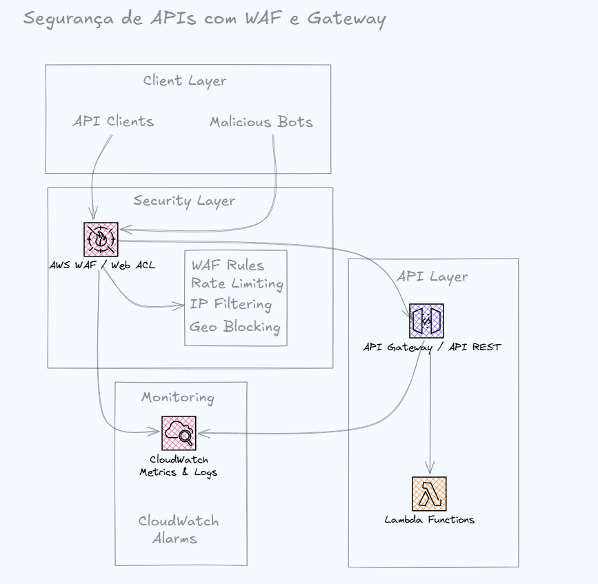

# terraform-aws-api-security

Secure serverless APIs on AWS using AWS WAF, API Gateway, Lambda, CloudWatch, and Terraform.

## Overview

This project implements and validates a security architecture for serverless APIs on AWS. It combines **AWS WAF** as a protection layer, **API Gateway** as the API entry point, **AWS Lambda** as the backend, and **CloudWatch** for observability.

The entire infrastructure is provisioned as code using **Terraform**, enabling repeatable, auditable, and automated deployments.

## Architecture

The request flow follows this path:

```
Client → API Gateway → AWS WAF → Lambda → CloudWatch (Logs & Metrics)
```

AWS WAF inspects incoming requests before they reach the API, applying managed rules, rate limiting, IP filtering, and geo-blocking. Valid requests are forwarded to API Gateway, which invokes the Lambda backend. All activity is logged and monitored through CloudWatch.

### Architecture Diagram



## Security Controls

The following security controls are implemented via AWS WAF and associated services:

- Rate limiting per IP address
- AWS Managed Rules (baseline protection ruleset)
- Protection against SQL Injection
- IP filtering (allow/deny lists)
- Geo blocking
- WAF logs and metrics
- CloudWatch alarms for security events

## Project Structure

```
terraform-aws-api-security/
├── docs/
│   └── architecture.png
├── infra/
│   ├── api_gateway.tf
│   ├── lambda.tf
│   ├── main.tf
│   ├── monitoring.tf
│   ├── variables.tf
│   └── waf.tf
├── scripts/
│   ├── deploy.sh
│   ├── destroy.sh
│   └── test-waf.sh
├── src/
│   └── index.py
├── .gitignore
└── README.md
```

## Prerequisites

Before deploying, make sure you have the following installed and configured:

- [Terraform](https://developer.hashicorp.com/terraform/downloads) >= 1.x
- [AWS CLI](https://docs.aws.amazon.com/cli/) configured with valid credentials
- Python 3.x (for the Lambda function)
- Bash shell (Linux/macOS or WSL on Windows)

Configure your AWS credentials before running any script:

```bash
aws configure
```

## Deployment

Deployment is fully automated through the `deploy.sh` script, which packages the Lambda function and provisions the infrastructure with Terraform.

```bash
# Clone the repository
git clone https://github.com/<your-username>/terraform-aws-api-security.git
cd terraform-aws-api-security

# Give execution permission to the scripts
chmod +x scripts/*.sh

# Run the deployment
./scripts/deploy.sh
```

The `deploy.sh` script performs the following steps:

1. Packages the Lambda function
2. Runs `terraform init`
3. Validates the Terraform configuration
4. Runs `terraform plan`
5. Runs `terraform apply`

## Validation Tests

The following tests validate that the security architecture behaves as expected.

Run the validation suite:

```bash
./scripts/test-waf.sh
```

### 1. Legitimate Traffic

- **Expected result:** HTTP 200
- The request passes through AWS WAF and reaches the Lambda function successfully.

### 2. SQL Injection Attempt

- **Expected result:** HTTP 403
- The malicious request is identified and blocked by AWS WAF before reaching the backend.

### 3. Rate Limiting

- A sequence of requests is sent to validate the configured rate limit.
- Once the threshold is exceeded, subsequent requests are blocked by AWS WAF.
- The blocking event can be observed in CloudWatch logs and metrics.

## Validation Evidence

Screenshots demonstrating the test results should be added to the `docs/` folder as they become available:

- `docs/test-success.png` — Legitimate request returning HTTP 200
- `docs/sql-injection-blocked.png` — SQL Injection attempt blocked with HTTP 403
- `docs/rate-limit.png` — Requests blocked after exceeding the rate limit
- `docs/cloudwatch-alarm.png` — CloudWatch alarm triggered by a security event

> Evidence images will be embedded here once collected, e.g. ``

## Cleanup

To remove all infrastructure created by Terraform:

```bash
./scripts/destroy.sh
```

This script requires confirmation before destroying the provisioned resources, preventing accidental deletion.

## Technologies

| Category               | Technology         |
| ---------------------- | ------------------ |
| Cloud Provider         | AWS                |
| Infrastructure as Code | Terraform          |
| WAF                    | AWS WAF v2         |
| API Layer              | API Gateway (REST) |
| Compute                | AWS Lambda         |
| Observability          | Amazon CloudWatch  |
| Backend Language       | Python             |
| Automation             | Bash               |

## Disclaimer

This project was built for educational and portfolio purposes, to demonstrate practical skills in AWS security, serverless architecture, and Infrastructure as Code with Terraform. It is not intended for direct use in production environments without further review, hardening, and adaptation to specific security and compliance requirements.
